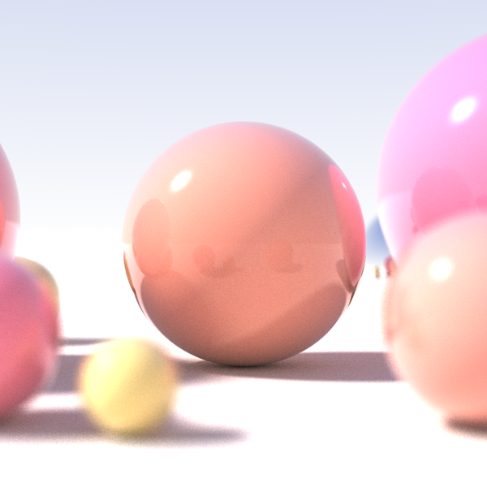

# Computer Graphics

This repository aims to explore Computer Graphics concepts and tools.

| 		            |                                                                         | Description                                     | 
| :----------------:|:-----------------------------------------------------------------------:|:------------------------------------------------|
| [Raytracing (v1)](https://github.com/NelsonBilber/cg.raytracing.v1)                       |             | Raytracing in One Weekend            |
| [Open GL](https://github.com/NelsonBilber/ComputerGraphics/blob/master/docs/open_gl.md)   |          | Research how low a level graphic API works, what is needed to make a simple game loop, rotate some cubes, work with light and projections              |
| [Direct X](https://github.com/NelsonBilber/ComputerGraphics/blob/master/docs/direct_x.md) |         | Research how low a level graphic API works, what is needed to make a simple game loop, rotate some cubes, work with light and projections              |
| [Unreal Engine 4](https://github.com/NelsonBilber/ComputerGraphics/blob/master/docs/unreal_engine.md) |   | Samples and drafts about code from udemy course “The Unreal Engine Developer Course”            | 
| [Unity](https://github.com/NelsonBilber/udemy.gamephysics)                                |           |Code from Udemy Course ” Game Physics - Introduction Gravitation and Rotation in Unity ”             |
| [Math tricks](https://github.com/NelsonBilber/ComputerGraphics/blob/master/docs/math.md)  |         | Algebra calculations            |

